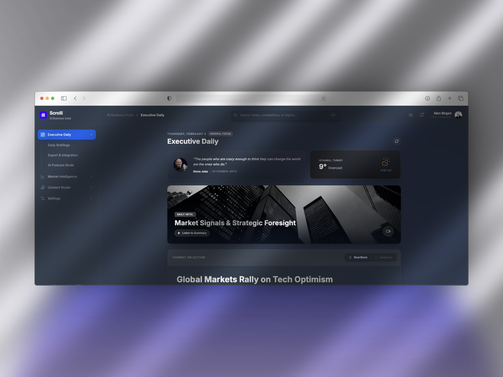

<div align="center">
  
  
  <br />
  
  <h1>AI Business Suite</h1>
  <p><strong>The Next-Generation Executive Intelligence Engine</strong></p>
  
  <p>
    <a href="#features">Features</a> •
    <a href="#getting-started">Getting Started</a> •
    <a href="#tech-stack">Tech Stack</a>
  </p>
</div>

---

## Overview

**AI Business Suite** is a state-of-the-art decision support platform designed for C-level executives and strategic leaders. It leverages **Google's Gemini 2.5 Flash** to aggregate global market signals, synthesize daily briefings, and generate predictive competitor analyses in real-time.

Built with a focus on **Neo-Brutalist/Glassmorphism** aesthetics, the interface provides a premium, distraction-free environment for high-stakes decision making.

## ✨ Key Features

### 📊 Executive Daily
- **AI-Curated Briefings**: Synthesizes thousands of news sources into a "State of the Market" digest.
- **Podcast Mode**: Converts written briefs into a 2-host audio dialogue (Alara & Arda) using specialized TTS.
- **Responsive Layout**: Optimized 3+2 grid for desktop, stacking gracefully for mobile/tablet.

### 📡 Market Intelligence
- **Sector Heatmap**: Real-time visualization of global market performance.
- **Emerging Niche Detection**: Identifies "under-the-radar" trends (e.g., Solid-State Batteries, Space Logistics) before they hit mainstream headlines.
- **Predictive Engine**: A chat interface specifically tuned for forecasting and correlation analysis.

### 🎯 Competitor Radar
- **Live SWOT Analysis**: Comparative "Gartner-style" radar charts.
- **Strategic Takeaways**: AI-generated action items based on competitor moves.

### ⚡ Enhanced Experience
- **Command Palette (`Cmd+K`)**: Global fuzzy search for navigation, insights, and system actions.
- **Mobile Drawer**: Smooth, gesture-friendly navigation for executives on the go.
- **Dark/Light Mode**: Fully thematic support with ambient lighting effects.

## 🛠 Tech Stack

- **Core**: React 19, TypeScript, Vite
- **Styling**: Tailwind CSS (Custom Design System)
- **AI/LLM**: Google GenAI SDK (Gemini 2.5 Flash)
- **Visualization**: Recharts, Lucide React
- **Interaction**: cmdk, Framer Motion principles

## 🚀 Getting Started

### Prerequisites
- Node.js (v18+)
- A Google GenAI API Key

### Installation

1. **Clone the repository**
   ```bash
   git clone https://github.com/Scrollico/frontenddemo.git
   cd frontenddemo
   ```

2. **Install dependencies**
   ```bash
   npm install
   ```

3. **Configure Environment**
   Create a `.env.local` file in the root directory:
   ```env
   GEMINI_API_KEY=your_api_key_here
   ```

4. **Run Locally**
   ```bash
   npm run dev
   ```

## 🔒 Security & Privacy
- **Client-Side Processing**: Data is processed securely; mock modes available for offline use.
- **No Hardcoded Secrets**: Strictly uses environment variables.

---

<div align="center">
  <p><i>Empowering Leadership with Artificial Intelligence.</i></p>
</div>
